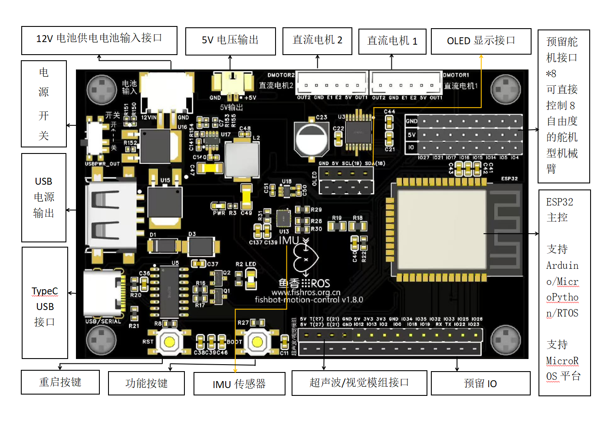
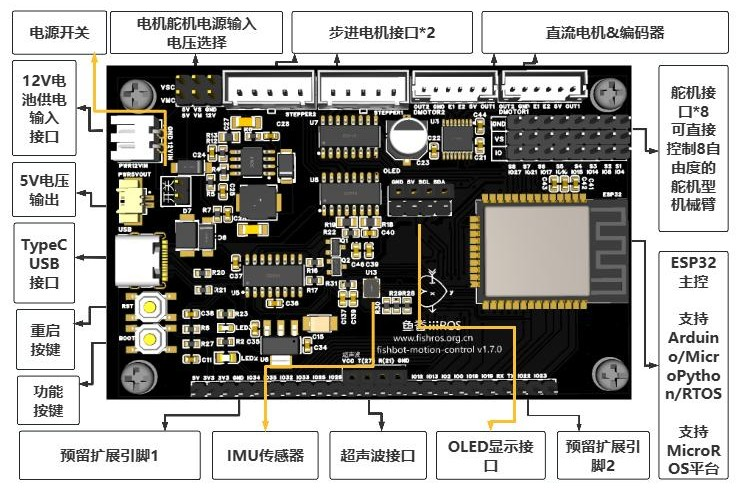
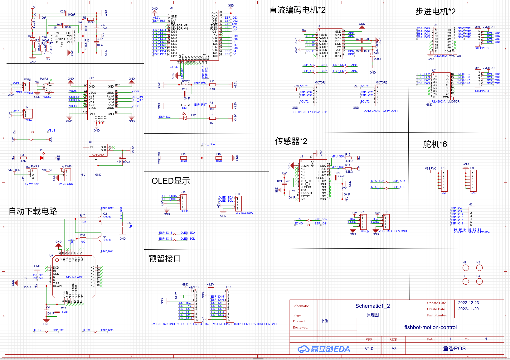
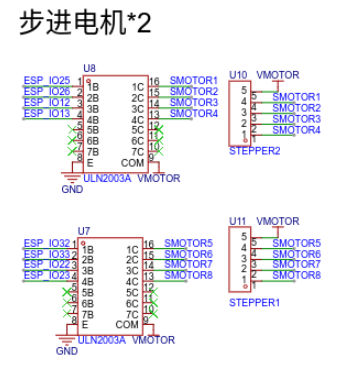
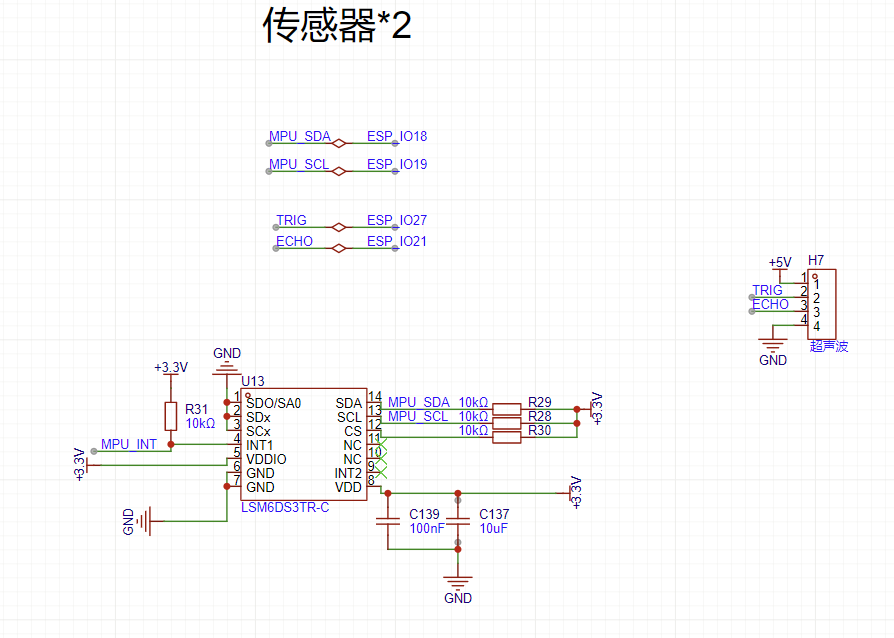
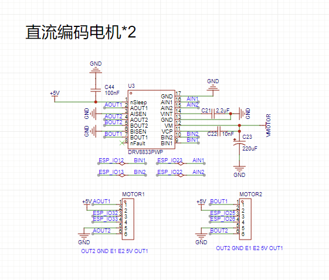
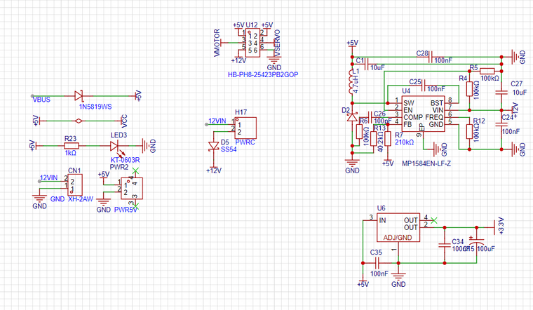

# FISHBOT ESP32

## Versi 2WD



## Versi 4WD(Gantian)



Di Ubuntu 22.04, Anda mungkin mengalami masalah seperti kegagalan pengenalan perangkat atau masalah izin. Silakan lihat solusi berikut:

- Mengatasi masalah ini: [https://fishros.org.cn/forum/topic/1050/ubuntu22-04-ch340系列次港芯片不能认终极问题解决 (Solusi Utama untuk Masalah Chip Port Serial yang Tidak Dikenal di Ubuntu 22-04-ch340 Series)](https://fishros.org.cn/forum/topic/1050/ubuntu22-04-ch340系列串口芯片无法识别终极问题解决方案)
- Izin: [https://fishros.org.cn/forum/topic/1150/serialportusbpermanentpermissionssetting](https://fishros.org.cn/forum/topic/1150/串口usb永久权限设置)

## I. Seri Tutorial Memulai Cepat FishBot

**Disematkan dan disorot: Disarankan menggunakan Ubuntu 22.04 ROS2 versi Humble.**
**Disematkan dan disorot: [Asisten konfigurasi FishBot dan halaman rilis firmware (klik untuk melompat).](https://fishros.org.cn/forum/topic/368)**

**[9.0.0. Proses Pembelajaran FishBot](https://fishros.org.cn/forum/topic/3388/fishbot机器人开发学习流程)**
9.0.1. Tutorial Perakitan FishBot 4WD V2:[ Roda Diferensial](https://gcnwibcr1vzf.feishu.cn/wiki/GCkPwMpmeiuPu2kOg0pcrnItnCg) |[ Roda Mekanum](https://gcnwibcr1vzf.feishu.cn/wiki/BjTjwVJVuiwOc4kaPpKcBXgxnYe?from=from_copylink)
9.0.2. Pengenalan dan Unduhan Asisten Konfigurasi [(Versi Video](https://www.bilibili.com/video/BV1MQkwYNEi4) |[ Versi Teks)](https://fishros.org.cn/forum/topic/933)
9.0.3. Pembakaran dan Konfigurasi Firmware Papan Kontrol Utama ([ Versi Video](https://www.bilibili.com/video/BV1oAC5YJEdT) |[ Versi Teks)](https://fishros.org.cn/forum/topic/3693)
9.0.4. Menggunakan Keyboard ROS2 untuk Mengontrol FishBot[ (Versi Video](https://www.bilibili.com/video/BV1PqkdY5Ew8/) |[ Versi Teks)](https://fishros.org.cn/forum/topic/938)
9.0.5. Pembakaran dan Konfigurasi Firmware Radar[ ( Versi Video](https://www.bilibili.com/video/BV1GH63YfEq2) |[ Versi Teks](https://fishros.org.cn/forum/topic/940/)
) 9.0.6. Uji Driver dan Pemetaan Radar[ ( Versi Video](https://www.bilibili.com/video/BV1HH6HYzErB) |[ Versi Teks)](https://fishros.org.cn/forum/topic/954)
9.0.7. Uji Navigasi FishBot-Nav2[ ( Versi Video](https://www.bilibili.com/video/BV1ePrFYvEvQ) |[ Versi Teks)](https://fishros.org.cn/forum/topic/961)

[Ekstensi 1: Tutorial Driver Radar FishBot (Versi Kode Sumber)](https://fishros.org.cn/forum/topic/1523/拓展-fishbot配套雷达驱动教程-源码版)
[Ekstensi 2: Cara Menggunakan micros-agent untuk Menggerakkan Mainboard pada Raspberry Pi](https://fishros.org.cn/forum/topic/1295/agent-手动编译-不用docker-以及树莓派上使用micros-agent的方法/10)
[Ekstensi 3: Konfigurasi FishBot Raspberry Pi dan Navigasi Peta](https://fishros.org.cn/forum/topic/1524/拓展3-fishbot-树莓派配置建图导航/1)

## II. Membangun robot bergerak fisik (sesuai Bab 9 buku ini, versi detail dari versi penggerak empat roda)

- [9.1 Desain Sistem Robot Seluler](https://www.bilibili.com/video/BV1NyFNeEEAh)
- [9.2.1 Pengenalan dan Instalasi Platform Pengembangan](https://www.bilibili.com/video/BV1pLf2YxEzv)
- [9.2.2 Proyek HelloWorld Pertama](https://www.bilibili.com/video/BV11cPXeoEfg)
- [9.2.3 Menggunakan kode untuk menyalakan LED](https://www.bilibili.com/video/BV1FTNpeKEbG)
- [9.2.4 Menggunakan gelombang ultrasonik untuk mengukur jarak](https://www.bilibili.com/video/BV18FNbeNEE5)
- [9.2.5 Menggunakan pustaka sumber terbuka untuk menggerakkan IMU](https://www.bilibili.com/video/BV1LgN8ejEHG)
- [9.3.1 Menggunakan pustaka sumber terbuka untuk menggerakkan beberapa motor](https://www.bilibili.com/video/BV1UiNmeHEe1)
- [9.3.2 Pengukuran dan konversi kecepatan motor](https://www.bilibili.com/video/BV11ZNdeuEge)
- [9.3.3 Menggunakan kontrol PID untuk mengontrol kecepatan roda](https://www.bilibili.com/video/BV137KPezEaH)
- [9.3.4 Realisasi solusi kinematika maju dan mundur](https://www.bilibili.com/video/BV1XwKTejE6V)
- [9.3.5 Perhitungan Odometri Robot](https://www.bilibili.com/video/BV1BJA5eTE9t)
- [9.4.1 Node Pertama](https://www.bilibili.com/video/BV1kQAqeCEE9)
- [9.4.2 Berlangganan Bot Kontrol Topik](https://www.bilibili.com/video/BV12rPue6EoY)
- [9.4.3 Mempublikasikan topik odometri robot](https://www.bilibili.com/video/BV12rPue6EoY)
- [9.5.1 Mengemudi dan menampilkan awan titik radar](https://www.bilibili.com/video/BV1JnPeewEQ5)
- [9.5.2 Pengantar Kerangka Sistem Koordinat Robot Seluler](https://www.bilibili.com/video/BV1QmP7eBEz2)
- [9.5.3 Mempersiapkan Robot URDF](https://www.bilibili.com/video/BV1Fk9AYnEg2)
- [Versi 9.5.4 merilis odometer TF.](https://www.bilibili.com/video/BV1Uq93YRE5T)
- [9.5.5 Selesaikan pemetaan robot dan simpan peta.](https://www.bilibili.com/video/BV1yVXXYbETt)
- [9.5.6 Navigasi robot lengkap](https://www.bilibili.com/video/BV12L9hYrEkp)

## Alamat sumber terbuka terkait

1. Repositori utama FishBot: https://github.com/fishros/fishbot_nav
2. Versi IDF driver papan kontrol utama FishBot - https://github.com/fishros/fishbot-motion-control
3. Driver papan kontrol utama FishBot versi MicroROS - https://github.com/fishros/fishbot_motion_control_microros
4. FishBotSDK- https://github.com/fishros/fishbot-motion-driver
5. Asisten Konfigurasi FishBot - https://github.com/fishros/fishbot_tool
6. Driver Adaptor Laser Fishbot - https://github.com/fishros/fishbot-laser-control
7. Penggerak FishBotROS2 - https://github.com/fishros/fishbot-control-ros2
8. Fishbot menggunakan driver radar X2 - https://github.com/fishros/ydlidar_ros2.git
9. Kode sumber FishBot 4WD V1: https://github.com/fishros/fishbot_motion_control_microros_four_driver
10. Kode sumber firmware yang mendasari untuk penggerak empat roda V2 tersedia di: https://github.com/fishros/fishbot_motion_control_microros_four_driver_v2
11. Kode sumber pemetaan dan navigasi 4WD V2: https://github.com/fishros/fishbot_nav


## Definisi pin

```c++
#define LED_BUILTIN 2
// FishBot I2C pins IMU(LSM6DS3) dan OLED(0.96")
#define SDA_PIN 18
#define SCL_PIN 19
// ===== MOTOR PIN DEFINITIONS =====
#define MOTOR0_A 22  // Motor Kanan Forward
#define MOTOR0_B 23  // Motor Kanan Backward
#define MOTOR1_A 12  // Motor Kiri Forward
#define MOTOR1_B 13  // Motor Kiri Backward

// ===== ENCODER PIN DEFINITIONS =====
#define ENCODER0_A 32  // Encoder Kanan A
#define ENCODER0_B 33  // Encoder Kanan B
#define ENCODER1_A 26  // Encoder Kiri A
#define ENCODER1_B 25  // Encoder Kiri B
int stepperPins[] = {22, 23, 12, 13, 32, 33, 26, 25};
```


>💡 **Catatan Penting:**
>
>- Mode kontrol DRV8833:  
>  - `IN1=HIGH, IN2=LOW` → motor maju  
>  - `IN1=LOW, IN2=HIGH` → motor mundur  
>  - `IN1=IN2=LOW` → free-wheel (coast)  
>  - `IN1=IN2=HIGH` → brake  

------

## 🧩 **FishBot Four-Driver GPIO Mapping Table (ESP32-WROOM-32)**

| GPIO                       | Fungsi Utama                                     | Bentrok dengan             |
| -------------------------- | ------------------------------------------------ | -------------------------- |
| 2                          | LED builtin                                      | –                          |
| 12                         | DC Motor Kiri (BIN1) **/ Stepper2 IN3**          | Stepper2                   |
| 13                         | DC Motor Kiri (BIN2) **/ Stepper2 IN4**          | Stepper2                   |
| 18                         | I²C SDA (OLED/IMU)                               | –                          |
| 19                         | I²C SCL (OLED/IMU)                               | –                          |
| 22                         | DC Motor Kanan (AIN1) **/ Stepper1 IN3**         | Stepper1                   |
| 23                         | DC Motor Kanan (AIN2) **/ Stepper1 IN4**         | Stepper1                   |
| 25                         | Encoder Kiri B **/ Stepper2 IN1 / Stepper1 IN3** | Stepper1/2, encoder L      |
| 26                         | Encoder Kiri A **/ Stepper2 IN2 / Stepper1 IN4** | Stepper1/2, encoder L      |
| 32                         | Encoder Kanan A **/ Stepper1 IN1**               | Stepper1, encoder R        |
| 33                         | Encoder Kanan B **/ Stepper1 IN2**               | Stepper1, encoder R        |
| 4,5,14, 15, 16, 17, 21, 27 | Cadangan (GPIO umum)                             | –                          |
| 34–39                      | Input-only                                       | Bukan untuk output/stepper |

## 💡 **Tips Penggunaan Aman**

| Kondisi                        | Langkah Aman                                       |
| ------------------------------ | -------------------------------------------------- |
| Ingin pakai DC motor + encoder | Pastikan ULN2003 tidak aktif  dan cabut Stepper    |
| Ingin pakai stepper            | Cabut konektor encoder dan jangan aktifkan DRV8833 |
| Ingin I2C OLED/IMU             | Aman selalu, SDA=18, SCL=19                        |

## 🧠 Kesimpulan Akhir

> Board hanya bisa beroperasi **dalam satu mode ** —  **DC Motor (DRV8833)** atau **Stepper (ULN2003)**.
>
> Mode DC motor + encoder adalah **default** dan **aman**.
> Mode stepper hanya bisa digunakan jika **DRV8833 & encoder** dinonaktifkan sepenuhnya.


**Schematic V1.0**



Stepper:



## IMU



## Motor



Design Switching:


## Referensi utama

- https://github.com/fishros/fishbot_motion_control_microros_four_driver_v2

- https://github.com/fishros/fishbot_nav.git

**Forum**

- 2 channel https://fishros.org.cn/forum/topic/923 
- 4 channel https://fishros.org.cn/forum/topic/3466/fishbot%E5%9B%9B%E9%A9%B1v2-%E8%B5%84%E6%96%99%E6%95%99%E7%A8%8B%E6%B1%87%E6%80%BB

**schematic**

- https://fishros.org.cn/forum/topic/894/fishbot%E4%B8%BB%E6%8E%A7%E6%9D%BF%E5%8E%9F%E7%90%86%E5%9B%BE%E5%BC%80%E6%BA%90%E5%88%86%E4%BA%AB/7

**Pembelian**

- https://item.taobao.com/item.htm?id=695473143304 -> 2 channel

- https://item.taobao.com/item.htm?id=893190632037 -> 4 Channel

- https://shop526563875.taobao.com/ 

**PPT**

- https://gcnwibcr1vzf.feishu.cn/wiki/GCkPwMpmeiuPu2kOg0pcrnItnCg

  
  
  
  
  

